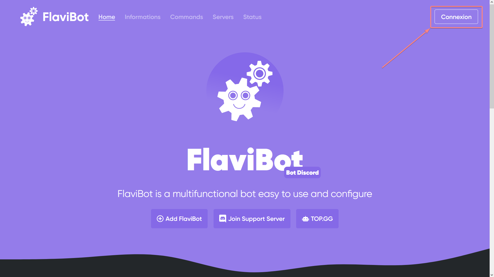
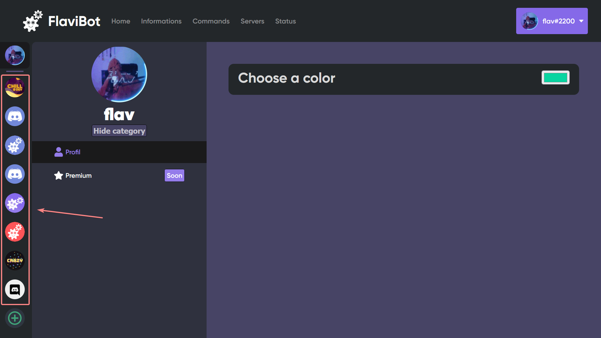
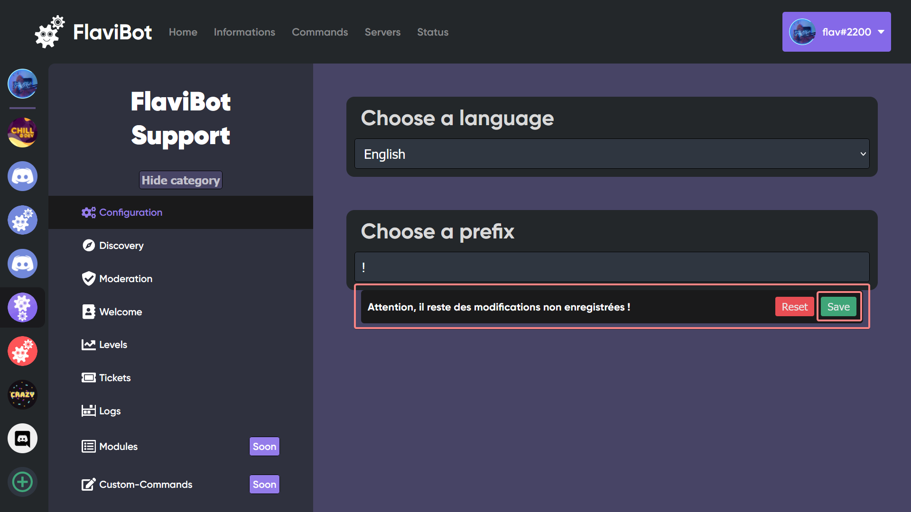

# Configuration

## Comment configurer FlaviBot ?

### Connexion


### Pour configurer FlaviBot rendez-vous sur le site [https://flavibot.xyz](https://flavibot.xyz)



#### Puis connecté vous



#### Félicitation vous êtes connecté !



#### Maintenant rendez vous sur le dashboard pour commencer la configuration



Maintenant choisissez un serveur ou ce trouve FlaviBot puis cliquez dessus



Vous pouvez désormais choisir la catégorie à gauche et ensuite modifier les informations en rapport avec celle-ci.



Une fois les modifications effectuées n'oublié pas de sauvegarder pour que tous soit bien pris en compte.


