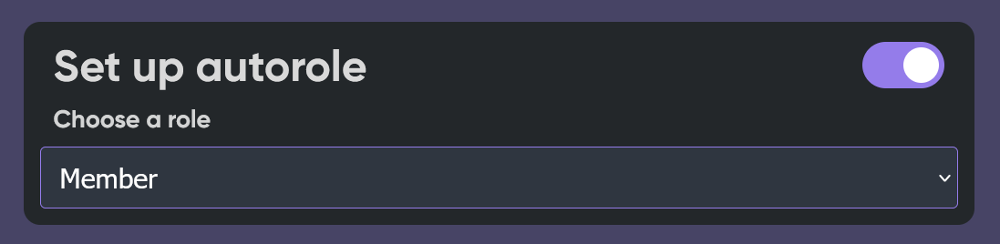

# Arrivé/départ et Autorole

## Préparation


Rendez-vous sur le Dashboard dans la partie **Welcome** et activer l'autorole.


## Autorole

### Instructions

1. Activé l'autorole.
2. Choisissez le rôle à donné lorsqu'un membre rejoint le serveur.


Assurez vous que le bot ai un rôle au dessus de celui à attribuer


## Arrivé

### Instructions

1. Activé les messages de bienvenues.
2. Choisissez le salon ou le bot va envoyer le message lorsqu'un membre rejoint le serveur.
3. Puis écrivez un message d'accueil.

### Paramètres

* `{user.name} - flav`
* `{user.discriminator} - 2200`
* `{user.tag} - flav#2200`
* `{user.id} - 360783331962650624`
* `{server.name} - FlaviBot Support`
* `{server.member_count} - 720`


N'oublier pas de cliquer sur **Save** une fois vos modifications souhaiter.


## Départ

### Instructions

1. Activé les messages de bienvenues.
2. Choisissez le salon ou le bot va envoyer le message lorsqu'un membre quitte le serveur.
3. Puis écrivez un message d'accueil.

### Paramètres

* `{user.name} - flav`
* `{user.discriminator} - 2200`
* `{user.tag} - flav#2200`
* `{user.id} - 360783331962650624`
* `{server.name} - FlaviBot Support`
* `{server.member_count} - 720`


N'oublier pas de cliquer sur **Save** une fois vos modifications souhaiter.


